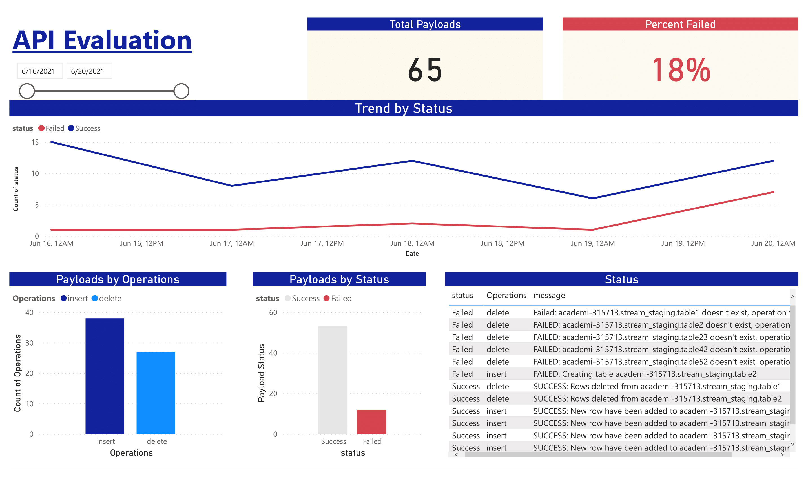

# Gatekeeper-Pub-Sub

## Project Overview
After a very enthusiastic IPO, our company immediately experienced a significant increase in traffic. Therefore, we are developing our backend by recruiting more engineers. The back end will build a system that can capture all user activity data. As a data engineer we will transport the data in real time and then put it in some database (postgres / BQ) so that later the business team will be able to create the reports they need. Unfortunately, the backend will not allow us to tap their databases since accessing production data directly will potentially harm the database performance. The backend team will send the user activity in JSON format so we have to prepare our API called Gatekeeper.

On top of that, we want to report and improve the API over time. For that, we need some sort of visualization to see various metrics.  The first metric is failed vs success payloads, Last we also want to measure the performance of the gatekeeper API.

## Task
- Create API
- Create Consumer
- Visualize Metrics

## Stack
- FastAPI
- Google Pub/Sub
- Google BigQuery
- PowerBI

## Installation
Type code below to setup `topic` and `subscriber` in Google Pub/Sub
```
./bash-script.sh
```
open another terminal to start the API
```
pip install -r requirements.txt
cd app
uvicorn main:app --reload
```
open another terminal to view the subscriber
```
cd pubsub
python subscriber.py
```

## Result

